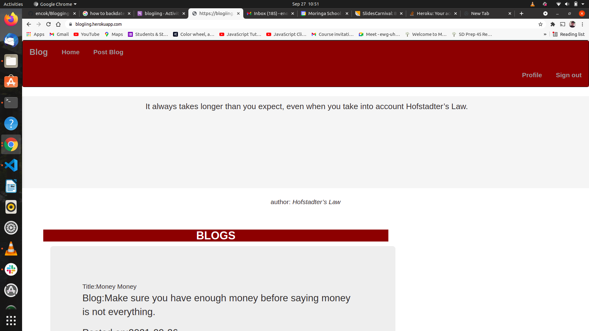
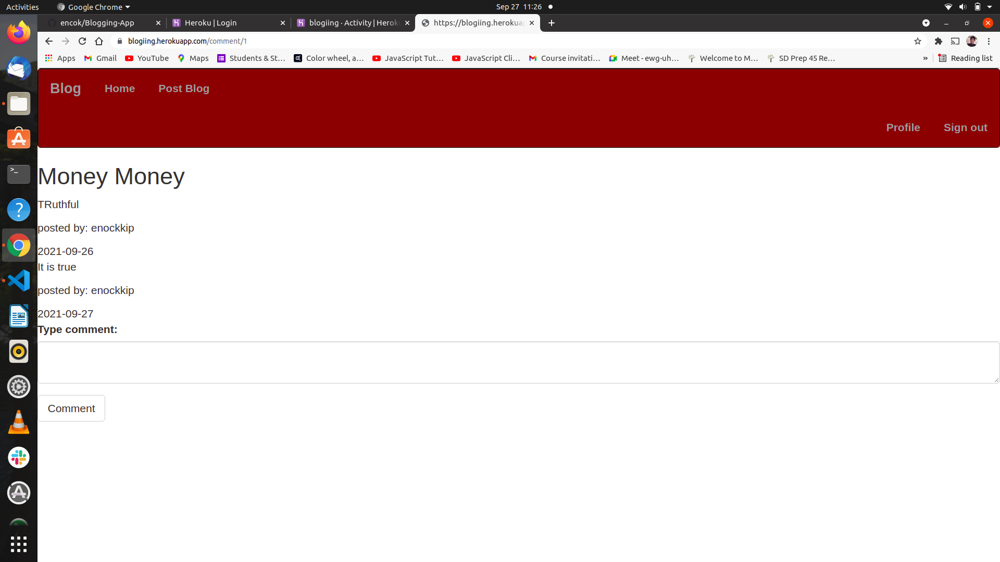

# Project Title
Blogging-App

# Author
  **[Enock Kipronoh](https://github.com/encok)**

## Link to Live Site 
https://github.com/encok/Blogging-App

## Description
  This is an application that allows a user to write and post a blog. The visitors of the site can view the blogs and comment on them. However, the user is supposed to sign up and then login first in order to write or comment on  the posted blogs. You can view your comment that you posted.
  

## Screenshots

## Installation Requirements
  Clone this repository and navigate to the folder.
  Run the following commands to allow functionality of the app:-
  * sudo add-apt-repository ppa:jonathonf/python-3.8
  * sudo apt-get update
  * sudo apt-get install python3.8
  * sudo apt-get install python3-pip
  * sudo apt-get install python3.8-venv
  * python3.8 -m venv virtual
  * source virtual/bin/activate
  * pip install -r requirements.txt

## User Stories
* A user can view the blog posts on the site
* A user can comment on blog posts
* A user can view the most recent posts
* A user can see random quotes on the site
* A user is able to sign in to the blog.
* A user is also able create a blog from the application.
## Technologies Used
  * Python 3.8
  * HTML5, CSS and Bootstrap
  * Flask Framework
  * Postgressql
  * Heroku

## Known Bugs
No known bugs so far

## Support Details
Contact me for further help  
email: enckkipronoh@gmail.com 
Phone: 0717854859
## License
This is the link to the MIT license used  

https://github.com/encok/Blogging-App/blob/master/LICENSE